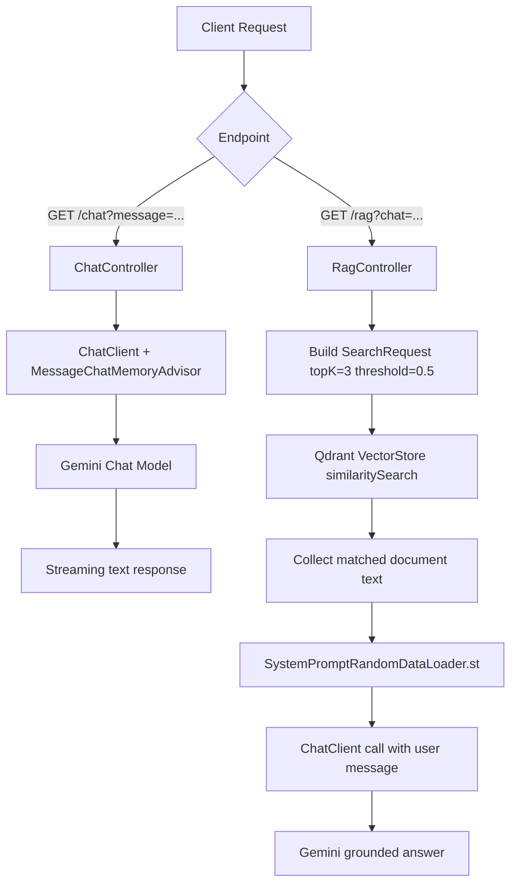

# simple_rag_app

A minimal Spring Boot + Spring AI Retrieval-Augmented Generation (RAG) demo using:
- **Google Gemini** for chat + embeddings
- **Qdrant** as the vector store
- **Spring AI** advisors/memory for contextual chat

## What happens under the hood

1. App starts and `RandomDataLoader` inserts sample knowledge sentences into Qdrant.
2. For `/rag`, user input is embedded and used to run similarity search in Qdrant.
3. Top matching documents are injected into a strict system prompt template.
4. Gemini generates an answer grounded in retrieved context.
5. For `/chat`, messages are handled as normal chat with conversation memory.

## Flow diagram



## Project structure

- `/src/main/java/com/yash/spring_ai/controller/ChatController.java`  
  Simple chat endpoint with streaming response and conversation memory.
- `/src/main/java/com/yash/spring_ai/controller/RagController.java`  
  RAG endpoint that retrieves relevant docs and injects them into system prompt.
- `/src/main/java/com/yash/spring_ai/rag/RandomDataLoader.java`  
  Loads sample domain text into vector store on startup.
- `/src/main/java/com/yash/spring_ai/config/GoogleGenAiEmbeddingConfig.java`  
  Embedding model bean configuration.
- `/src/main/resources/PromptTemplates/SystemPromptRandomDataLoader.st`  
  Prompt template enforcing context-grounded answers.
- `/compose.yml`  
  Qdrant container definition.

## Prerequisites

- Java 17+
- Maven (or use `./mvnw`)
- Docker
- Google GenAI API key

## Configuration

Set your API key (used by `spring.ai.google.genai.api-key=${api_key}`):

```bash
export api_key="YOUR_GOOGLE_GENAI_KEY"
```

## Run locally

1. Start Qdrant:
   ```bash
   docker compose up -d
   ```
2. Start app:
   ```bash
   ./mvnw spring-boot:run
   ```

## API usage

### Chat endpoint

```bash
curl -N "http://localhost:8080/chat?message=Hello" \
  -H "conversation_id: demo-user-1"
```

### RAG endpoint

```bash
curl "http://localhost:8080/rag?chat=What is Kubernetes?" \
  -H "username: demo-user-1"
```

## Notes

- RAG prompt is intentionally strict: if info is not in retrieved documents, model should answer **"I don't know"**.
- This repo is a learning/demo project with in-memory-like startup data loading behavior via `@PostConstruct`.
